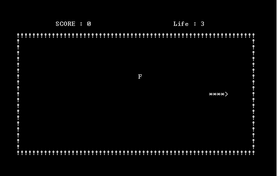

This project in retrospect was a simple project to say the least. Our prompt was simple: design a game to run on the console output of a computer. Unfortunately I do not have source code or a picture of the project due to the creation of it being on an unreachable server. My team was "ambitious" and instead of going for the common word games or math games, went for a game of snake. The reason I am showcasing this project is not because of its complexity or its fascinating graphics, but because I am particularly proud of this project being that it was my first team project and because at the time, seemed impossible to code. 
This project was designed by myself alon with two of my peers and took approximately two weeks of us meeting 3-5 times a week to resync our programs and develop a plan for the days between our next meeting. During those two weeks we'd each code until we ran into an issue, meet up, help solve each other's issues, and assign new tasks for each other to do. 
This project was particularly challenging at the time due to the restraints of having to print the map in text based format to the console. In fact if you made multiple consecutive moves fast enough, you could see the console trying to keep up printing the map and refreshing the screen fast enough as we would have to clear the screen and reprint the map on every move. 
Like I said, a simple program in retrospect, however I am very proud of it due to our team working together, communicating effectively, and pulling it off by the deadline.

